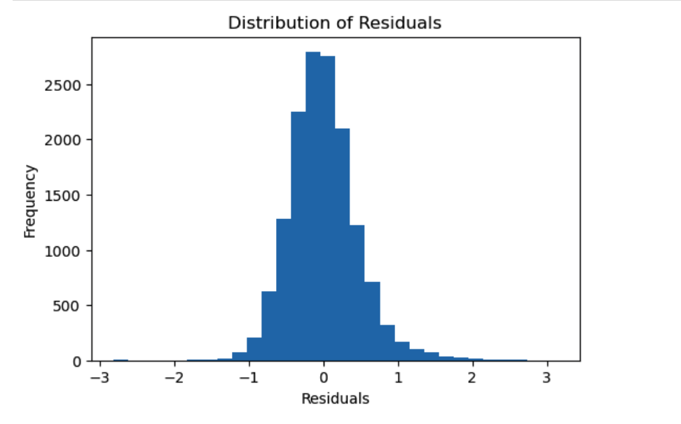

# Predicting Airbnb Prices Using Multiple Linear Regression 🏡

- This project focuses on predicting Airbnb rental prices using a dataset that contains listing information from multiple cities. The dataset includes both numerical and categorical variables like property type, room type, location, cleaning fee, cancellation policy, number of reviews, and host verification details. The goal of this project is to identify which factors have the greatest influence on Airbnb pricing and to develop a predictive model using multiple linear regression. By analyzing these relationships, this project's main goal is to provide insight into how different listing characteristics impact price and to demonstrate how predictive modeling can be applied to real world data.
---

# Objectives

- Build a multiple linear regression model to predict Airbnb listing prices
- Clean and process Airbnb listing data
- Analyze relationships between listing features and price
- Evaluate model performance using regression metrics
- Identify the variables that most influence Airbnb prices
- Communicate findings through visualizations and interpretation

---

# Dataset Overview

The dataset contains Airbnb listing information including features such as:

- Location
- Property type
- Room type
- Number of bedrooms
- Reviews
- Availability
- Booking information
- Price

The dataset contains 74,111 observations and 29 variables. Each observation represents an individual Airbnb listing, while each variable represents a feature of the listing such as price, location, or property characteristics. The dataset contained several variables with missing values such as host_response_rate, review_scores_rating, and first_review. Each variable had a significant number of missing observations. These missing values will be addressed by being removed.

---

# Tools and Libraries

- Python (`pandas`, `numpy`)
- scikit-learn (`LinearRegression`, `train_test_split`, `metrics`)
- matplotlib
- seaborn
- Jupyter Notebook

---

# Workflow

## 1. Data Cleaning and Preprocessing

- Removed unnecessary columns
- Handled missing values
- Encoded categorical variables
- Split the dataset into training and testing sets

## 2. Exploratory Data Analysis

- Examined distributions of Airbnb prices
- Analyzed relationships between predictors and price
- Identified trends 
- Visualized important variables

## 3. Model Building

- Built a Multiple Linear Regression model
- Trained the model using the training dataset
- Predicted Airbnb log prices using listing characteristics

## 4. Model Evaluation

The model was evaluated using:

- R squared
- Mean Absolute Error (MAE)
- Mean Squared Error (MSE)
- Root Mean Squared Error (RMSE)

## 5. Interpretation of Results

- Determined which features had the strongest relationship with Airbnb prices
- Compared predicted prices to actual prices
- Evaluated the overall predictive ability of the model

## Residual Distribution


The histogram below shows the distribution of residuals from the regression model.



---

# Results


The multiple linear regression model was evaluated using R-squared, Mean Absolute Error (MAE), Mean Squared Error (MSE), and Root Mean Squared Error (RMSE).

- **R-squared:** 0.58  
- **Mean Absolute Error (MAE):** 0.35  
- **Mean Squared Error (MSE):** 0.22  
- **Root Mean Squared Error (RMSE):** 0.46  

The multiple linear regression model produced an R squared value of about 0.58, which means the model explains around 58% of the variation in Airbnb log prices based on the variables included in the dataset. This suggests that features such as location, property type, review information, and other related variables had a meaningful relationship with Airbnb pricing.

The Mean Absolute Error (MAE) of about 0.35 shows that the model’s predictions are typically off by around 0.35 units on average. The Root Mean Squared Error (RMSE) of about 0.46 suggests that the model has a good amount of prediction error, while also giving more weight to larger errors.

Overall, the regression model demonstrated moderate predictive ability and was reasonably effective at identifying pricing patterns within the Airbnb dataset. While the model performed fairly well, additional variables such as seasonal demand, neighborhood popularity, host experience, and property amenities could potentially improve prediction accuracy in future analyses.

The findings suggest that machine learning and regression techniques can be useful tools for understanding and predicting Airbnb market pricing trends.

---

# Repository Structure

```bash
Airbnb_price_model/
│
├── Airbnb_price_model.ipynb     # Main Jupyter Notebook
├── Airbnb_Data.csv              # Dataset used for analysis
├── residual_distribution.png    # Residual distribution graph
├── README.md                    # Project overview
